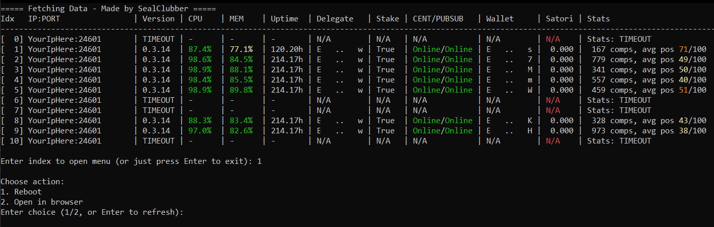

# Neuron-Monitor

This is a terminal-based dashboard to monitor Satori neuron endpoints in real time.



## Features

- Asynchronous fetching of neuron data from `/system_metrics` and `/fetch/wallet/stats/daily`
- Live updating terminal display with color-coded CPU, memory, and placement metrics
- Menu for per-node actions: open in browser or reboot

## Setup

### 1. Install Python & pip
Make sure Python 3.7+ and pip are installed on your system.

You can check by running:

```bash
python --version
pip --version
```

### 2. Install Dependencies
Install required packages with pip:

```bash
pip install aiohttp
```

### 3. Add Your IPs
Create a file named `ip.txt` in the root of the project directory.

Each line should contain an IP and port pair in this format:

```
127.0.0.1:24601
192.168.0.102:24601
...
```

### 4. Neuron Config
The Neuron has to be running without `headless: true` and `neuron lock hash: xyz`, if you do run with the lock the daily stats wont show.

### 5. Run the Logger

```bash
python neuron-monitor.py
```

## Support the Project

If you’re using this tool and want to support future development, you can register through my Satori referral link:

[👉 Join Satori via my referral link](https://satorinet.io/download/EazcyWn5zHZ5AdvjCrumX82YTh4RovmEuj)

Thanks for your support!
